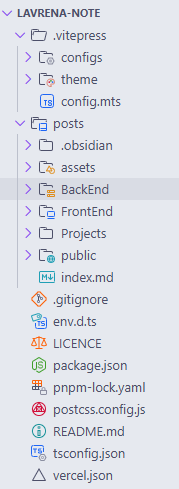

# 使用Vitepress将Obsidian仓库发布为静态网站

> 我的文档站就是用`Vitepress`搭建的，非常简单

## Obsidian配置

> **喜欢用Obsidian，又不喜欢装插件的，有没有？**

### 0插件

用ob两年了，一个插件都没装，不想折腾。


### wiki链接
ob中的`[[ ]]` 双链语法，在`vitepress`中是不支持的，所以我在ob的设置中关闭了wiki链接这个选项，**不过ob厉害的是，用纯markdown语法`[]()`也可以实现双链功能。**


## VitePress

### 初始化

> 参考官网：[快速开始 | VitePress](https://vitepress.dev/zh/guide/getting-started)

### 目录配置

我的目录配置：



> [!NOTE]
> 配置`srcDir`目录为ob仓库文件夹名，下次使用ob编辑文档时，直接打开`post`目录，这样ob内就不会显示`vitepress`脚手架相关的配置内容。

```ts
export default defineConfig({
	srcDir: "./posts",
	//按需：不想让vitepress渲染的文档在这里配置
	srcExclude: [".obsidian", 'templates', 'Clippings'], 
})
```

### 导航栏

我在每个一级目录下放了index索引文件，这样导航栏配置只需到一级目录的文件夹名即可，vitepress会默认渲染当前文件夹下的`index.md`文件

```ts
nav: [
   { text: '前端', link: '/FrontEnd' },
   { text: '后端', link: '/BackEnd' },
],
```

### 自动生成侧边栏

> 使用自动生成侧边栏插件：[vite-plugin-vitepress-auto-sidebar](https://github.com/QC2168/vite-plugin-vitepress-auto-sidebar)

### 安装插件

```bash
pnpm i -D vite-plugin-vitepress-auto-sidebar
```

### 配置插件

在 `.vitepress/config.mts` 中

```ts 
export default defineConfig({
    vite: {
        plugins: [
            AutoSidebar({
                path: '/posts', //设置要生成侧边栏的目录
                ignoreList: ['public', 'assets', '.obsidian', 'templates'], //设置忽略目录
                ignoreIndexItem: true, //是否忽略index.md
                titleFromFile: true, //是否从文件标题获取标题
            })
        ]
    }
})
```

> [更多配置参考](https://github.com/QC2168/vite-plugin-vitepress-auto-sidebar)

### 侧边栏排序问题

插件默认是根据标题的首字母排序的，个人感觉不太好，想根据文件标题排序。

> [参考issues](https://github.com/QC2168/vite-plugin-vitepress-auto-sidebar/issues/40)

```ts
AutoSidebar({
    titleFromFile: true,

    // 侧边栏排序
    beforeCreateSideBarItems: (data) => {
        console.log(data);

        function getOrder(item: string): number {
            let res = item.match(/(?<order>\d+)/);
            if (res) {
                return parseInt(res.groups.order);
            }
            return 0;
        }

        data.sort((a, b) => {
            return getOrder(a) - getOrder(b);
        });

        return data;
    },
}),
```

### markdown语法高亮

ob中的`==标记内容==` 在`vitepress`中默认是不支持的，安装`vitepress`插件即可在页面上渲染`== ==` markdown语法

```bash
pnpm add -D markdown-it-mark
```

```ts
import markdownMark from 'markdown-it-mark';

export default defineConfig({
	//other config...
	markdown: {
	    config: (md) => {
	      md.use(markdownMark)
	    },
	},
})
```

> 推荐一下大佬编写的`VitePress`美化教程，很详细！！[更多关于Vitepress样式美化参考](https://vitepress.yiov.top/style.html)


## 部署

> 用`Vercel`，免费!

首先需要新建一个`GitHub`仓库，（公共私有均可），注册[`Vercel`](https://vercel.com/)账号，绑定新建的`Github`仓库，`Vercel`会自动监听仓库的代码提交动作，自动部署。

> 具体操作参考：[部署 VitePress 站点 | VitePress](https://vitepress.dev/zh/guide/deploy#github-pages)，很简单。

### 自定义域名

我用的[`Vercel`](https://vercel.com/)部署，`Vercel`会有一个免费的域名，但是免费的域名在国内访问很慢，所以我绑定了自己的域名


## Git（可选）

使用`deploy.sh`脚本，每次编辑后可自动触发提交代码操作，将`vitepress`静态页面部署到`Vercel`上。

```sh
#!/bin/bash

# 检查是否有未提交的更改
if git diff-index --quiet HEAD --; then
    echo "没有未提交的更改"
    exit 0
fi

# 提交所有更改
git add .
git commit -m "更新笔记"

# 推送更改到远程仓库
git push

```

## PS.记录本站的小小目标

> 一直以来，我都想找一个软件，能够存放我从事开发这么多年以来学过的知识。

[Obsidian](https://obsidian.md/)是我用的时间最长的笔记软件了

它的一些核心功能真的很好用，强大的核心插件，让我在不装第三方插件的情况下也可以用的很快乐。

可是随着笔记数量的增多，当我每次想记录点东西的时候，打开`Obsidian`都有一种巨大的压力感，面对着众多笔记却不知如何归类。文件夹，标签，书签傻傻分不清。

`Obsidian`的数据是在电脑本地存储的，这一点既是优点也是缺点。官方同步贵，第三方同步我又不想折腾，我尝试过其他软件，但是都感觉不好用。

因为我是做开发的，专业内的知识还是用电脑端编辑更方便一些，而在手机上只是为了方便查看，或者记录一些碎片化的内容

所以我想到用`VitePress`静态部署我的笔记，

用了VitePress之后，再打开Obsidian，==很神奇的是：那种压力感瞬间就没有了。==

> 因为我知道，`obsidian`是文本记录工具，而`vitepress`那些花里胡哨的样式，正是给本就枯燥无味的文字，增添了几分色彩。

VitePress还是Vue官方团队出品，而且Vue官方团队在之后将重点放在VitePress上，并作为长期的主要SSG推荐

它还支持移动端预览，部署之后，在手机和平板上也可以随时查看

> 这也是我一直以来想要实现的小小愿望
