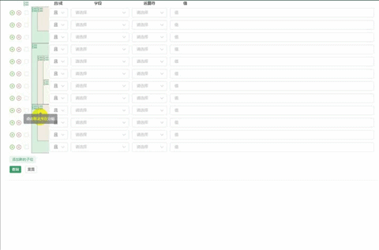

# 自定义条件组合组件

实现多条件分组组合查询-递归组件

> 文章参考：[Vue 动态查询条件-Vue 动态查询规则-Vue 多条件分组组合查询-递归组件(一):前端\_vue 自定义查询条件-CSDN 博客](https://blog.csdn.net/duanjunkaisky/article/details/124480485)
>
> **原作者用的 vue2 版本，我司项目使用的 vue3，借鉴此改造了下**
> 
> 我这里 UI 组件库用的 AntDesignVue

## 实现效果



## 具体实现

::: code-group

```vue [conditionGroup.vue]
<template>
  <div :class="{ marginClass: onlyOne }" v-if="reDraw">
    <div class="condition-header" v-if="onlyOne">
      <div class="group-button">
        <a-tooltip>
          <template #title>添加分组</template>                    
          <a-button type="primary" link @click.stop="_addGroup" size="small">添加分组</a-button>                
        </a-tooltip>  
      </div>
    </div>
    <div v-for="(item, index) in conditionList" :style="{ 'flex-direction': 'column' }">
      <div :style="{ display: 'flex', 'flex-direction': 'row', 'align-items': 'center' }" v-if="!item.terms">
        <div :style="{ display: 'flex', 'flex-direction': 'row', 'align-items': 'center' }">
          <a-checkbox style="padding: 0 10px 0 10px" v-model:checked="item.checked"></a-checkbox>  
                           
          <template v-if="floor > 1 && (!item.line || item.line.length == 0)">
                                   
            <div :style="{ width: gradWidth + leftWidth * (floor - item.floor - 1) + 'px', height: '42px' }"></div>
                               
          </template>
                             
          <template v-else v-for="(n, li) in item.line">
                                   
            <div
              :style="{
                width:
                  li == item.line.length - 1 ? gradWidth + leftWidth * (floor - item.floor) + 'px' : leftWidth + 'px',
                height: '42px',
                background: getFloorColor(li + 1),
              }"
              :class="{
                'group-left': n.l == 2,
                'group-top-left': n.l == 4,
                'group-bottom-left': n.l == 5,
              }"
            >
                                         
              <a-tooltip v-if="n.l == 4">
		        <template #title>点击取消所在分组</template>                    
                <a-button @click="_delGroup(item, n.p)" size="small" danger>x</a-button>                            
              </a-tooltip>              
            </div>      
          </template>
        </div>
                       
        <a-space>      
          <a-select v-model:value="item.type" style="width: 75px;padding: 5px 0 5px 1px">                 
            <a-select-option
              v-for="ot in [
                { key: '并且', val: 'and' },
                { key: '或者', val: 'or' },
              ]"
              :key="ot.val"
              :value="ot.val"
            >
               {{ ot.key }}                        
            </a-select-option>
          </a-select>
          <a-select v-model:value="item.column" style="width: 180px;" @change="(item.value = ''), (item.termType = '')">
                                   
            <a-select-option v-for="ot in keyList" :key="ot.val" :value="ot.val">
                 {{ ot.key }}                        
            </a-select-option>
                               
          </a-select>
                             
          <a-select
            v-model:value="item.termType"
            v-if="conditionMap && conditionMap[item.column]"
            style="width: 100px;"
          >
                                   
            <a-select-option v-for="ot in conditionMap[item.column]" :key="ot.val" :value="ot.val">
               {{ ot.key }}                        
            </a-select-option>
                               
          </a-select>
                             
          <a-select v-model:value="item.termType" v-else style="width: 100px;">
                                   
            <a-select-option v-for="ot in conditionSelect" :key="ot.val" :value="ot.val">
               {{ ot.key }}                        
            </a-select-option>
          </a-select>
                             
          <a-select
            v-model:value="item.value"
            v-if="valList && valList[item.column] && valList[item.column].dom == 'select'"
            style="width: 100px;"
          >
                                   
            <a-select-option v-for="ot in valList[item.column].data" :key="ot.val" :value="ot.val">
               {{ ot.key }}                        
            </a-select-option>
                               
          </a-select>
                             
          <a-time-picker
            v-else-if="valList && valList[item.column] && valList[item.column].dom == 'time'"
            v-model:value="item.value"
            format="HH:mm"
            value-format="HH:mm"
            style="width: 100px;"
          />
                             
          <a-input-number
            v-else
            v-model:value="item.value"
            placeholder="属性值"
            allowClear
            style="width: 100px;"
          ></a-input-number>
                              {{ valList[item.column] ? valList[item.column].unit : "" }}                
        </a-space>
                       
        <a-button
          class="el-icon-circle-plus-outline color-success font-title-large"
          style="cursor: pointer"
          @click="_addItem(item)"
          >添加</a-button
        >
                       
        <a-button
          class="el-icon-circle-close color-danger font-title-large"
          style="cursor: pointer;margin-left: 5px;"
          @click="_delItem(item)"
          >删除</a-button
        >
                   
      </div>
                 
      <RelationGroup
        :conditionList="item.terms"
        v-if="item.terms && item.terms.length > 0"
        :only-one="false"
        :parentData="parentData"
        :floor="floor"
        :borderColor="borderColor"
        :key-list="keyList"
        :val-list="valList"
        :condition-map="conditionMap"
      ></RelationGroup>
             
    </div>
    <a-button v-if="onlyOne" style="margin-top: 10px; cursor: pointer" @click="_addChild">添加条件</a-button>  
     
  </div>
</template>
<script setup>
import { onlyMessage } from "@/utils/comm";
const condition = {
  id: 1,
  index: 1,
  checked: false,
  pid: -1,
  floor: 1,
  termType: "",
  type: "and",
  column: "",
  value: "",
};
const props = defineProps({
  onlyOne: {
    type: Boolean,
    default: true,
  },
  floor: {
    type: Number,
    default: 1,
  },
  conditionList: {
    type: Array,
    default: () => [],
  },
  keyList: {
    type: Array,
    default: () => [],
  },
  conditionMap: {
    type: Object,
    default: () => {},
  },
  valList: {
    type: Object,
    default: () => {},
  },
  parentData: {
    type: Object,
    default: () => {},
  },
  gradWidth: {
    type: Number,
    default: 20,
  },
  leftWidth: {
    type: Number,
    default: 20,
  },
  groupBtnSize: {
    type: Number,
    default: 20,
  },
  borderColor: {
    type: Array,
    default: () => ["rgba(64, 158, 111, 0.2)"],
  },
});
const emits = defineEmits(["input"]);
const reDraw = ref(true);
const conditionSelect = reactive([
  { key: ">", val: "gt" },
  { key: "=", val: "eq" },
  { key: "<", val: "lt" },
  { key: ">=", val: "gtq" },
  { key: "<=", val: "ltq" },
]);
function findChecked(list, arrParam) {
  var arr = arrParam || new Array();
  for (var i = 0; i < list.length; i++) {
    var o = list[i];
    if (o.terms && o.terms.length > 0) {
      findChecked(o.terms, arr);
    } else {
      if (o.checked) {
        arr.push(o);
      }
    }
  }
  return arr;
}
function removeNode(list, targetList) {
  for (var i = 0; i < list.length; i++) {
    var o = list[i];
    for (var tid of targetList) {
      if (o.id == tid) {
        list.splice(i--, 1);
      }
    }
  }
}
function findParentGroups(list, pid, retParam) {
  var ret = retParam;
  for (var i = 0; i < list.length; i++) {
    var o = list[i];
    if (o.terms && o.terms.length > 0) {
      if (o.id == pid) {
        ret = o;
      } else {
        ret = findParentGroups(o.terms, pid, ret);
      }
    }
  }
  return ret;
}
function _addGroup() {
  addGroup(props.parentData.conditionList, props.parentData);
}
function _delGroup(item, groupId) {
  delGroup(groupId, props.parentData.conditionList, props.parentData);
}
function _addChild() {
  addChild(props.parentData.conditionList);
}
function _delItem(item) {
  delItem(props.conditionList, item, props.parentData.conditionList, props.parentData);
}
function _addItem(item) {
  addItem(props.conditionList, item.index, props.parentData.conditionList, props.parentData);
}
function addItem(groups, index, conditionList, parentThis) {
  var newItem = Object.assign({}, condition, {
    id: new Date().getTime(),
    index: index + 1,
    floor: groups[0].floor,
    pid: groups[0].pid,
  });
  groups.splice(index, 0, newItem);
  parentThis.floor = refreshData(conditionList);
}
function addChild(conditionList) {
  var newItem = Object.assign({}, condition, {
    id: new Date().getTime(),
    index: conditionList.length + 1,
    floor: 1,
    pid: -1,
  });
  conditionList.splice(conditionList.length, 0, newItem);
}
function delItem(groups, item, conditionList, parentThis) {
  var sum = countItem(conditionList);
  if (sum <= 1) {
    return;
  }
  groups.splice(item.index - 1, 1);
  var currentGroups = findParentGroups(conditionList, groups[0].pid);
  if (currentGroups) {
    var parentGroups = findParentGroups(conditionList, currentGroups.pid);
    if (currentGroups.terms.length == 1) {
      var ag = JSON.parse(JSON.stringify(currentGroups.terms[0]));
      ag.index = currentGroups.index;
      ag.id = currentGroups.id;
      ag.pid = parentGroups ? parentGroups.id : -1;
      ag.floor = currentGroups.floor;
      if (ag.terms) {
        ag.terms.forEach((o, index) => {
          o.pid = ag.id;
          o.floor = ag.floor + 1;
          o.index = index + 1;
        });
      }
      if (parentGroups) {
        var _groups = findParentGroups(conditionList, parentGroups.id);
        _groups.terms.splice(currentGroups.index - 1, 1, ag);
      } else {
        conditionList.splice(currentGroups.index - 1, 1, ag);
      }
    }
  }
  if (conditionList.length == 1 && conditionList[0].terms) {
    var newList = JSON.parse(JSON.stringify(conditionList[0].terms));
    conditionList.splice(0, 1);
    for (var nl of newList) {
      nl.pid = -1;
      nl.floor = 1;
      conditionList.push(nl);
    }
  }
  parentThis.floor = refreshData(conditionList);
}
function addGroup(conditionList, parentThis) {
  var checkedList = findChecked(conditionList);
  if (!checkedList || checkedList.length <= 1) {
    onlyMessage("至少选择2个条件项", "warning");
    return;
  }
  var checkNodes = [];
  for (var item of checkedList) {
    if (item.pid == -1) {
      uniquePush(checkNodes, item);
    } else {
      var pNode = getRealParent(conditionList, item, checkedList);
      if (pNode) {
        uniquePush(checkNodes, pNode);
      }
    }
  }
  var _tmpRoot = [];
  for (var ck of checkNodes) {
    var _tmp = findParentGroups(conditionList, ck.pid);
    if (_tmp) {
      uniquePush(_tmpRoot, _tmp);
    }
  }
  var allSelectCount = 0;
  var floorCount = [];
  for (var cn of checkNodes) {
    if (cn.terms) {
      allSelectCount += countItem(cn.terms);
    } else {
      allSelectCount++;
    }
    if (floorCount.indexOf(cn.floor) == -1) {
      floorCount.push(cn.floor);
    }
  }
  var rootGroup = findParentGroups(conditionList, checkNodes[0].pid);
  if (_tmpRoot.length > 1) {
    rootGroup = findParentGroups(conditionList, rootGroup.pid);
    allSelectCount = 0;
    for (var cn of _tmpRoot) {
      if (cn.terms) {
        allSelectCount += countItem(cn.terms);
      } else {
        allSelectCount++;
      }
    }
  }
  var rootArray = conditionList;
  if (rootGroup) {
    rootArray = rootGroup.terms;
  }
  var allCount = countItem(rootArray);
  var currentSelectCount = checkedList.length;
  if (allSelectCount != currentSelectCount || floorCount.length > 1) {
    onlyMessage("不能交叉分组", "warning");
    return;
  }
  if (checkNodes.length == 1 || allCount == currentSelectCount) {
    onlyMessage("无效分组", "warning");
    return;
  }
  var newCheckNode = JSON.parse(JSON.stringify(checkNodes));
  newCheckNode.sort(function (a, b) {
    return a.index - b.index;
  });
  var groupId = new Date().getTime();
  var newGroup = {
    terms: newCheckNode,
    id: groupId,
    index: newCheckNode[0].index,
    pid: newCheckNode[0].pid,
    floor: newCheckNode[0].floor,
  };
  var waitRemoveNode = [];
  for (var o of newCheckNode) {
    o.floor += 1;
    o.pid = groupId;
    if (!o.terms) {
      o.checked = false;
    }
    waitRemoveNode.push(o.id);
  }
  if (!rootGroup) {
    removeNode(conditionList, waitRemoveNode);
    conditionList.splice(newCheckNode[0].index - 1, 0, newGroup);
  } else {
    var _groups = findParentGroups(conditionList, rootGroup.id);
    removeNode(_groups.terms, waitRemoveNode);
    _groups.terms.splice(newCheckNode[0].index - 1, 0, newGroup);
  }
  parentThis.floor = refreshData(conditionList);
}
function delGroup(groupId, conditionList, parentThis) {
  var parentGroups = findParentGroups(conditionList, groupId);
  var rootGroups = findParentGroups(conditionList, parentGroups.pid);
  var waitRemoveNode = [parentGroups.id];
  var newList = JSON.parse(JSON.stringify(parentGroups.terms));
  newList.forEach((o, index) => {
    o.pid = parentGroups.pid;
    o.floor = parentGroups.floor;
    o.checked = false;
  });
  if (!rootGroups) {
    removeNode(conditionList, waitRemoveNode);
    newList.forEach((o, index) => {
      conditionList.splice(parentGroups.index - 1 + index, 0, o);
    });
  } else {
    var _groups = findParentGroups(conditionList, rootGroups.id);
    removeNode(_groups.terms, waitRemoveNode);
    newList.forEach((o, index) => {
      _groups.terms.splice(parentGroups.index - 1 + index, 0, o);
    });
  }
  parentThis.floor = refreshData(conditionList);
}
function getRealParent(allItems, item, checkedList) {
  var parentGroups = findParentGroups(allItems, item.pid);
  var ret = parentGroups;
  if (parentGroups) {
    var childCount = countItem(parentGroups.terms);
    var realChildCount = 0;
    for (var cl of checkedList) {
      if (cl.pid == parentGroups.id) {
        realChildCount++;
      } else {
        var pg = findParentGroups(allItems, cl.pid);
        if (pg) {
          if (pg.pid == parentGroups.id) {
            realChildCount++;
          } else {
            while (pg && pg.pid != parentGroups.id) {
              pg = findParentGroups(allItems, pg.pid);
              if (pg && pg.pid == parentGroups.id) {
                realChildCount++;
              }
            }
          }
        }
      }
    }
    if (childCount == realChildCount) {
      var _tmp = getRealParent(allItems, parentGroups, checkedList);
      if (_tmp) {
        ret = _tmp;
      }
    } else {
      ret = item;
    }
  }
  return ret;
}
function reIndex(list, i, arr) {
  for (var index = 0; index < list.length; index++) {
    var o = list[index];
    if (arr.indexOf(i) == -1) {
      arr.push(i);
    }
    if (o.terms && o.terms.length > 0) {
      o.index = index + 1;
      o.floor = i;
      if (i == 1) {
        o.pid = -1;
      }
      reIndex(o.terms, i + 1, arr);
    } else {
      o.index = index + 1;
      o.floor = i;
      o.checked = false;
      if (i == 1) {
        o.pid = -1;
      }
    }
  }
}
function drawLineGroup(list, currentFloor, retList) {
  for (var index = 0; index < list.length; index++) {
    var o = list[index];
    if (o.terms && o.terms.length > 0) {
      drawLineGroup(o.terms, currentFloor + 1, retList);
    } else {
      o.line = new Array(currentFloor - 1);
      if (retList.length == 0) {
        o.header = true;
      } else {
        o.header = false;
      }
      for (var _k = 0; _k < o.line.length; _k++) {
        o.line[_k] = { l: 2, p: -1 };
      }
      retList.push(o);
    }
  }
}
function refreshData(list) {
  var floorCountArr = [];
  reIndex(list, 1, floorCountArr);
  var maxFloor = floorCountArr.length;
  var ret = new Array();
  drawLineGroup(list, 1, ret);
  for (var item of ret) {
    var parentGroup = findParentGroups(list, item.pid);
    if (item.pid != -1) {
      if (item.index == 1) {
        let node = { l: 4, p: parentGroup.id };
        item.line[item.line.length - 1] = node;
      } else if (item.index == parentGroup.terms.length) {
        let node = { l: 5, p: -1 };
        item.line[item.line.length - 1] = node;
      }
    }
    if (parentGroup) {
      var parentIndex = parentGroup.index;
      var parentLength = parentGroup.terms.length;
      var i = 2;
      var currentParentGroup = findParentGroups(list, parentGroup.pid);
      while (currentParentGroup) {
        if (i != 2) {
          parentGroup = JSON.parse(JSON.stringify(currentParentGroup));
          currentParentGroup = findParentGroups(list, parentGroup.pid);
        }
        if (currentParentGroup) {
          if (parentGroup.index == 1 && item.index == 1 && parentIndex == 1) {
            var node = { l: 4, p: currentParentGroup.id };
            item.line[item.line.length - i] = node;
          } else if (parentGroup.index == currentParentGroup.terms.length && item.index == parentLength) {
            item.line[item.line.length - i] = { l: 5, p: -1 };
          } else {
            break;
          }
          i++;
        }
      }
    }
  }
  return maxFloor;
}
function countItem(list, i) {
  var sum = i || 0;
  for (var index = 0; index < list.length; index++) {
    var o = list[index];
    if (o.terms && o.terms.length > 0) {
      sum += countItem(o.terms, i);
    } else {
      sum++;
    }
  }
  return sum;
}
function uniquePush(arr, item) {
  var exist = false;
  for (var o of arr) {
    if (o.id == item.id) {
      exist = true;
    }
  }
  if (!exist) {
    arr.push(item);
  }
}
const randomHexColor = () => {
  return randomColor("0.2");
};
function randomColor(alpha) {
  alpha = alpha == undefined ? ((Math.random() * 10) / 10).toFixed(1) : alpha;
  alpha = Number(alpha);
  if (isNaN(alpha)) alpha = 1;
  let col = "rgba(";
  for (let i = 0; i < 3; i++) {
    col += Math.random() * 256 + ",";
  }
  col += alpha + ")";
  return col;
}
function getFloorColor(floor) {
  return props.borderColor[floor - 1];
}
// const { conditionList } = toRefs(props)
watch(props.conditionList, (val, oldVal) => {
  emits("input", val);
  while (props.borderColor.length < props.floor) {
    var _color = randomHexColor();
    while (props.borderColor.indexOf(_color) != -1) {
      _color = randomHexColor();
    }
    props.borderColor.push(_color);
  }
  reDraw.value = false;
  nextTick(() => {
    reDraw.value = true;
  });
});
</script>
<style scoped lang="less">
:root {
    --borderWidth: 1px;
    --borderColor: rgba(158, 158, 158, 1);
}
table {
    border-collapse: collapse;
}
.marginClass {
    margin-bottom: 10px;
}
.condition-item {
    display: flex;
    flex-direction: row;
    align-items: center;
}
.group-item {
    margin-bottom: 5px;
}
.group-button {
    // margin-left: 47px;
    display: flex;
    flex-direction: row;
    align-items: center;
    justify-content: flex-end;
}
.group-left {
    border-left: var(--borderWidth) solid var(--borderColor);
}
.group-top-left {
    border-top: var(--borderWidth) solid var(--borderColor);
    border-left: var(--borderWidth) solid var(--borderColor);
}
.group-bottom-left {
    border-bottom: var(--borderWidth) solid var(--borderColor);
    border-left: var(--borderWidth) solid var(--borderColor);
}
</style>
```

```vue [demo.vue]
 
<RelationGroup
  :floor="floor"
  :conditionList="conditionList"
  :parentData="ppp"
  :key-list="keyOptions"
  :condition-map="conditionOptions"
  :val-list="valueOptions"
>
</RelationGroup>
<script setup lang="ts">
type OptionsKey = { key: string; val: string };
//默认条件值
const condition = {
  id: 1,
  index: 1,
  checked: false,
  pid: -1,
  floor: 1,
  termType: "",
  type: "and",
  column: "",
  value: "",
};
const floor = ref(1);
const conditionList = reactive([Object.assign({}, condition)]); //when
const conditionOptions = reactive({
  type: [{ key: "=", val: "eq" }],
  source: [{ key: "=", val: "eq" }],
});
const valueOptions = ref({});
const keyOptions = ref<OptionsKey[]>([]);
//给子组件传递的数据一定要是响应式的
const ppp = reactive({ conditionList, floor, keyOptions, conditionOptions, valueOptions });
</script>
```

:::

## 注意：使用组件这里有个小坑

`demo.vue` 在给`parentData` prop 传参的时候，原作者使用的是`this`

`this`在 vue2 中指代的就是`data()`函数，而 vue3 组合式 API 中没有`this`，一开始为了方便，
直接写成了`:parentData="{ conditionList, floor, keyOptions, conditionOptions }"`

这就导致了 传递给子组件的`parentData` 不是响应式的，导致后面在页面操作时分组的线一直显示不出来，`fuck~这个bug找了一下午，/(ㄒoㄒ)/~~`
