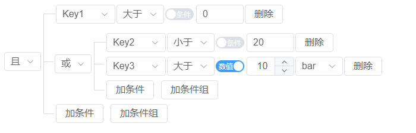

# 自定义条件组合组件2

> 本文引用自：[流云君-条件组合组件--vue3版——博客园](https://www.cnblogs.com/yun10011/p/18322475)
>
> 原作者用的是vue3+element-plus，我司项目用的是antdesignvue3，借鉴此改造了一下

## 实现效果



## 代码

::: code-group

```vue [relationGroup.vue]

<template>
  <div class="relation-group">
    <div class="relational">
      <a-select class="relation-sign" :dict="dict" v-model:value="value" @change="getChangePos"> </a-select>
    </div>
    <div class="conditions">
      <div v-for="(v, i) in children" :key="v">
       <RelationGroup
          v-if="v.children && v.children.length"
          :pos="getNewPos(i)"
          :data="v"
          @onTermChange="handleTermChange"
        >
        </RelationGroup>
        <RelationItem
          v-else
          :pos="getNewPos(i)"
          :data="v"
          @toDelete="toDelete"
          @getChange="getChange"
        >
       </RelationItem>
      </div>
      <div class="operators">
        <a-button plain class="add-term" @click="handleAddTerm('addTerm')">加条件</a-button>
        <a-button  plain class="add-group" @click="handleAddGroup('addGroup')">加条件组</a-button>
      </div>
    </div>
  </div>
</template>
<script setup>
import { onMounted, computed, ref, defineEmits, toRaw,reactive } from 'vue'
import RelationItem from './RelationItem'
import { posSeparator } from '@/utils/model'
const Gemit = defineEmits(['onTermChange']);
const props = defineProps({
  pos: {
    type: String,
    default: '',
  },
  data: {
    type: [Array,Object],
    default: () => {},
  },
})
onMounted(()=>{
console.log('props.data',props.data,props.data.children);
})
// const {children,ops}=reactive(props.data)
const children = computed(() => {
  return props.data.children;
});
const ops = computed(() => {
  return props.data.ops;
})
const defaultOpsValue = 'and'
const relationValue = ops.value || defaultOpsValue
const value=ref(relationValue)
const getNewPos = (i) => {
  // 如果当前项是整个 value (即组件的起始项)时，新位置即当前序号
  return props.pos?`${props.pos}${posSeparator}${i}`:String(i)
}
const dict = [
  { label: '且', value: 'and' },
  { label: '或', value: 'or' },
]
const record = { key: '', op: '', value: '' }
const group = {
  ops: 'and',
  children: [{ key: '', op: '', value: '' }]
}
const handleAddTerm=(e)=>{
  Gemit('onTermChange',e, props.pos,record)
}
const handleAddGroup=(e)=>{
  Gemit('onTermChange',e, props.pos,group)
}
const handleTermChange=(e,pos,v)=>{
  Gemit('onTermChange',e, pos,v)
}
const getChangePos=(e)=>{
 Gemit('onTermChange', 'changeOps', props.pos,{key:'ops',value:e})
}
const toDelete=(pos)=>{
  Gemit('onTermChange', 'deleteTerm', pos,'')
}
const getChange=(e,pos)=>{
  Gemit('onTermChange', 'changeTerm', pos,e )
}
</script>
<style lang="scss" scoped>
.relation-group{
    display: flex;
}
.operators{
    margin-left: 20px;
}

</style>
```

```vue [relationItem.vue]
<template>
  <div class="relation-item">
    <div class="term">
      <span class="element">
        <a-select
          placeholder="请选择条件项"
          v-model:value="termvalue.key"
          :dict="Edict"
          @change="getChange"
        >
        </a-select>
      </span>
      <span class="comparison">
        <a-select placeholder="请选择关系符" v-model:value="termvalue.op" :dict="Cdict" @change="getChange">
        </a-select>
      </span>
      <span>
        <a-switch v-model:value="termvalue.flag" inline-prompt active-text="数值" inactive-text="条件"/>
      </span>
      <span class="value" v-if="termvalue.flag">
        <a-input-number
          v-model:value="termvalue.value"
          class="mx-4"
          :min="1"
          controls-position="right"
          style="width: 80px"
          @change="getChange"
        />
        <a-select
          placeholder="单位"
          v-model:value="termvalue.units"
          :dict="Unitsdict"
          style="width: 80px"
          @change="getChange"
        >
        </a-select>
      </span>
      <span class="value" v-else>
        <a-input placeholder="请输入条件值" v-model="termvalue.valueKey" style="width: 80px" @change="getChange" />
      </span>
    </div>
    <a-button plain class="delete-term" @click="toDelete"> 删除 </a-button>
  </div>
</template>
<script setup>
import { onMounted, reactive, ref, defineEmits, toRaw } from 'vue'
const Demit = defineEmits(['toDelete','getChange'])
const props = defineProps({
  pos: {
    type: String,
    default: '',
  },
  data: {
    type: [Array, Object],
    default: () => {},
  },
})
const { key, op, value,valueKey, flag, units } = reactive(props.data)
const termvalue = reactive({
  key: key,
  op: op,
  flag:flag??false,
  value: value,
  valueKey: valueKey,
  units: units,
})
const Cdict = [
  { label: '等于', value: '==' },
  { label: '不等于', value: '!=' },
  { label: '大于', value: '>' },
  { label: '小于', value: '<' },
  { label: '大于等于', value: '>=' },
  { label: '小于等于', value: '<=' },
]
const Edict = [
  { label: 'Key1', value: 'Key1' },
  { label: 'Key2', value: 'Key2' },
  { label: 'Key3', value: 'Key3' },
]
const Unitsdict = [
  { label: 'Key1', value: 'Key1' },
  { label: 'Key2', value: 'Key2' },
  { label: 'Key3', value: 'Key3' },
]
const toDelete = () => {
  Demit('toDelete', props.pos)
}
const getChange = () => {
  Demit('getChange',termvalue,props.pos)
}
</script>
<style lang="scss" scoped>
.relation-item {
  display: flex;
  margin-left: 20px;
}
.term {
  display: flex;
  > span {
    margin-right: 2px;
  }
}
.value {
  display: flex;
  > div {
    margin-left: 2px;
  }
}
.element {
  width: 100px;
}
.comparison {
  width: 80px;
}
</style>


```

```js [model.js]

/**
 * @param {object} data RelationTree 完整的 value
 * @param {string} pos 位置字符串，形如：0_0_1
 * @param {string} type 操作类型，如：addTerm, addGroup, changeOps(改变逻辑运算符 &&、||), changeTerm, deleteTerm
 * @param {string} record 变更的单项值
 */
import _ from 'lodash'
export const getNewValue = (data = {}, pos = '', type, record) => {
  const arrPos = getArrPos(pos)
  const last = arrPos.length - 1
  let draft = _.cloneDeep(data)
  if (type !== 'changeOps' && !pos) {
    draft.children.push(record)
    return draft
  }
  let prev = { data: draft, idx: 0 }
  // 暂存遍历到的当前条件组的数据
  let current = draft.children || []
  // 根据 pos 遍历数据，pos 中的每一个数字代表它所在条件组的序号
  arrPos.forEach((strIdx, i) => {
    const idx = Number(strIdx)
    if (i === last) {
      console.log('current', arrPos, current)
      switch (type) {
        case 'addTerm':
        case 'addGroup': // 加条件或条件组,添加操作需要多一层children
          current = (current[idx] && current[idx].children) || []
          current.push(record)
          break
        case 'deleteTerm': // 删除条件项
          current.splice(idx, 1)
          if (!current.length && Array.isArray(prev.data)) {
            prev.data.splice(prev.idx, 1)
          }
          break
        case 'changeOps': // 变更逻辑连接符
          current[idx][record.key] = record.value
          break
        default: // 变更条件项内容
          current[idx] = record
      }
    } else {
      // 将下一个条件组的数据复制到 current
      prev = { data: current, idx }
      current = (current[idx] && current[idx].children) || []
    }
  })
  //  })
  console.log('draft', draft)
  return draft
}

export const getArrPos = pos => {
  return (pos && pos.split(posSeparator)) || []
}

export const posSeparator = '_'


```

```css [css]

.relation-tree {
  .relation-group {
    .relational {
      width: 85px;
      padding: 0 4px 0 18px;
      margin: 16px 0;
      border-right: 1px solid #d9d9d9;
      display: flex;
      align-items: center;
    }

    .conditions {
      > div {
        position: relative;
        padding-top: 8px;
        &::before {
          content: '';
          display: inline-block;
          position: absolute;
          top: 50%;
          left: 0px;
          width: 16px;
          height: 1px;
          border-bottom: 1px solid #d9d9d9;
          background-color: #fff;
        }
        &:first-child {
          &::before {
            width: 16px;
            height: 24px;
            top: 0px;
            left: -1px;
            width: 20px;
          }
        }

        &.relation-group:before {
          top: 20px;
        }
        &:last-child {
          &::before {
            top: inherit;
            bottom: 15px;
            left: -20px;
            width: 17px;
            border-bottom: 0;
            border-top: 1px solid #d9d9d9;
          }
        }
      }
    }
  }
}

```
:::

